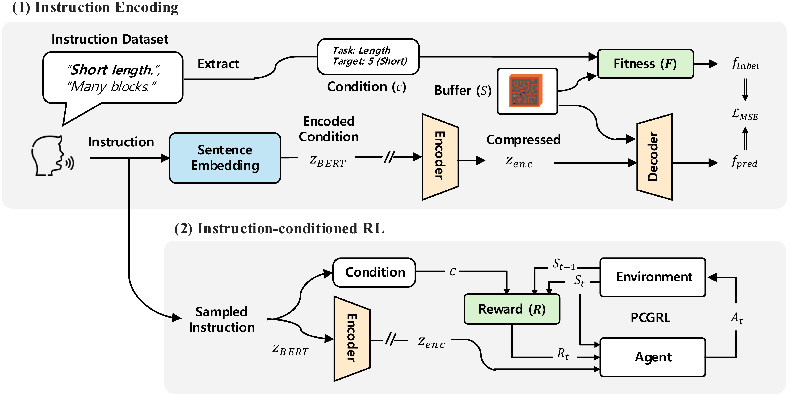

# IPCGRL: Language-Instructed Reinforcement Learning for Procedural Level Generation

## Overview
Official codebase for IPCGRL: Language-Instructed Reinforcement Learning for Procedural Level Generation




## Task & Reward functions
We have defined five controllable tasks, and the descriptions and implementations of the reward functions for each task are as follows.

Each reward function is converted into actual rewards through [reward calculation code](instruct_rl/reward_set.py#L18) and used for training.

| Task Name       |  Task Description                                        | Reward Function |
|-----------------|----------------------------------------------------------|-----------------|
| Region          | Controls the number of independent regions in the level                     | [code](evaluator/evaluator/evaluate_region.py)|
| Path Length     | Controls the target distance between any two reachable points within the level | [code](evaluator/evaluator/evaluate_path_length.py)|
| Wall Count | Controls the target number of wall tiles in the level                        | [code](evaluator/evaluator/evaluate_amount.py)|
| Bat Count  | Controls the target number of bat tiles placed in the level                  | [code](evaluator/evaluator/evaluate_amount.py)|
| Bat Direction   | Controls the distribution of bat tiles across the four cardinal directions   | [code](evaluator/evaluator/evaluate_direction.py)|


## Instruction Dataset
The dataset of instructions used in the paper's experiments is as follows:

| Instruction Task Type | Dataset csv|
|-----------|--------------|
| Single-task Instruction |  [scn-1_se-whole.csv](instruct/test/bert/scn-1_se-whole.csv) |
| Multi-task instruction |  [scn-2_se-whole.csv](instruct/test/bert/scn-2_se-whole.csv) |


## Installation
1. Create a Conda Environment with Python 3.11

    ```bash
    conda crate -n ipcgrl python=3.11
    conda activate ipcgrl
    ```

2. Install JAX

    Install __JAX__ according to the [official documentation](https://jax.readthedocs.io/en/latest/installation.html).

3. Install Required Dependencies

    ```bash
    pip install -r requirements.txt
    ```


## How to Run

### Collect Offline Data

First, collect offline data for training the encoder model. 
If you are experiencing memory issues, reduce the n_envs=600 parameter in the [script](./scripts/collect_offline_datas.sh).

```bash
bash scripts/collect_offline_datas.sh
```

### Train Encoder-Decoder

Train an encoder model that generates natural language embeddings $z_{enc}$.

```bash
python train_encoder.py embed_type=bert instruct=scn-1_se-whole buffer_dir=./pcgrl_buffer overwrite=True 
```


### Train RL Policy
- Control
    ```bash
    python train.py overwrite=True n_envs=600 vec_cont=True aug_type=test embed_type=bert instruct=scn-1_se-whole
    ```
    
- Control(Global)
    ```bash
    python train.py overwrite=True n_envs=600 vec_cont=True raw_obs=True aug_type=test embed_type=bert instruct=scn-1_se-whole
    ```

- IPCGRL($z_{bert}$)
    ```bash
    python train.py overwrite=True n_envs=600 model=nlpconv aug_type=test embed_type=bert instruct=scn-1_se-whole 
    ```
    
- IPCGRL($z_{enc}$) 
    ```bash
    python train.py overwrite=True n_envs=600 model=nlpconv aug_type=test embed_type=bert encoder.model=mlp encoder.ckpt_dir=./saves instruct=scn-1_se-whole
    ```


### Evaluate RL Policy
- Random
    ```bash
    python eval.py overwrite=True n_envs=100 aug_type=test embed_type=bert random_agent=True reevaluate=True instruct=scn-1_se-whole 
    ```

- Control
    ```bash
    python eval.py overwrite=True n_envs=100 vec_cont=True aug_type=test embed_type=bert instruct=scn-1_se-whole
    ```

- Control(Global)
    ```bash
    python train.py overwrite=True n_envs=100 vec_cont=True raw_obs=True aug_type=test embed_type=bert instruct=scn-1_se-whole
    ```

- IPCGRL($z_{bert}$)
    ```bash
    python train.py overwrite=True n_envs=100 model=nlpconv aug_type=test embed_type=bert instruct=scn-1_se-whole
    ```
    
- IPCGRL($z_{enc}$) 
    ```bash
    python train.py overwrite=True n_envs=100 model=nlpconv aug_type=test embed_type=bert encoder.model=mlp encoder.ckpt_dir=./saves instruct=scn-1_se-whole
    ```